<p align="center">
  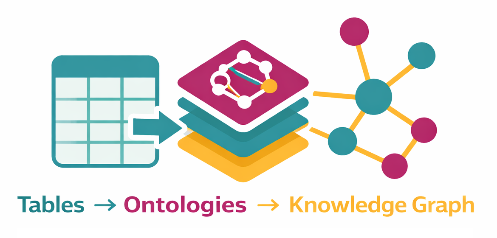
</p>

<p align="center">
  <strong>Turn spreadsheets into knowledge graphs — visually and without ontology expertise.</strong><br>
  A drag-and-drop mapping tool for RDF/OWL ontologies with built-in RDF export for your own data.
</p>

<p align="center">
  
  
  
  
</p>

---

## What is Table2Knowledge Studio?

Table2Knowledge Studio is a localhost web application that lets you map tabular data (CSV, TSV, Excel) onto RDF/OWL ontologies through an intuitive visual interface. You build a conceptual graph by dragging ontology classes onto a canvas, connect them with properties, assign table columns to nodes, and export the result as RDF — ready for your triplestore.  
It was originally developed for archaeological data modelling using CIDOC CRM and its extensions, but works with any **RDF/OWL ontology**.

### Why Table2Knowledge Studio?
 
- **No ontology expertise required** — visually map your data instead of a multi-step manual workflow
- **Works with any RDF/OWL ontology** — optimized for CIDOC CRM and its extensions
- **Visual graph builder** with automatic property suggestions based on domain/range inference (including dot-one properties and named graphs)
- **Full table mapping** — Load CSV/TSV/XLSX files, drag column headers onto graph nodes to assign IDs and labels
- **Publication-ready exports** — RDF (multiple formats), GraphML (yEd), PNG, SVG

<details>
<summary><b>See all features</b></summary>
 
- **Visual graph builder** — Drag-and-drop ontology classes, draw property connections, build your mapping visually
- **CIDOC CRM color convention** — Nodes are automatically colored by their CRM superclass
- **Ontology-aware** — Loads TTL/RDF/OWL files, browses class hierarchies, suggests valid properties with domain/range inference including `owl:inverseOf`
- **Table mapping** — Load CSV/TSV/XLSX files, drag column headers onto graph nodes to assign IDs and labels
- **Dot-One properties** — Visual support for RDF-star annotations (e.g. typing a relationship: `<< SU1 AP11_has_physical_relation_to SU2 >> P2_has_type "above"`)
- **Named Graphs** — Group nodes into named graphs (I4_Proposition_Set) with visual bounding boxes
- **Graph verification** — Checks for missing mappings, ID/label swaps, orphan nodes, widening warnings
- **Multi-format RDF export** — TriG, N-Quads, Turtle, RDF/XML, N-Triples, JSON-LD — with proper RDF-star syntax for dot-one properties
- **RDF Pipeline** — Integrated 3-step workflow: Export → Ontotext Refine → GraphDB
- **GraphML export** — yEd-compatible with colors, positions, and edge labels
- **Image export** — Publication-ready PNG (2× resolution) and editable SVG
 
</details>

---

<details>
<summary><h3 style="display:inline">Short overview of how Table2Knowledge Studio works</h3></summary>

### 1. Load an Ontology

Upload one or more TTL/RDF/OWL ontology files. The backend parses them and builds an inference cache for class hierarchies, property domains/ranges, and `owl:inverseOf` relationships.

### 2. Build Your Conceptual Graph

Use the **Triple Explorer** (side panel on the left) to browse the ontology:

- **① Subject** — Select a class (e.g. `E27_Site`)
- **② Predicate** — Pick a property (e.g. `P89_falls_within`)
- **③ Object** — Choose the range class (e.g. `E53_Place`)

Drag classes onto the canvas to create nodes. Connect them by drawing edges between handles, or let the tool auto-connect when you drop an object while a subject is selected.

### 3. Map Your Table Data

Switch to the **Table Panel**, load your CSV/TSV/XLSX file, and drag column headers onto nodes:

- **Upper drop zone** → Label column (display name)
- **Lower drop zone** → ID column (unique identifier)

### 4. Export

Choose your export format:

| Export | Description |
|---|---|
| **RDF** (TriG, Turtle, etc.) | Direct 1-click RDF export with RDF-star support |
| **RDF Pipeline** | 3-step workflow via Ontotext Refine → GraphDB |
| **GraphML** | yEd-compatible graph with colors and positions |
| **PNG** | Image at 2× resolution |
| **SVG** | Scalable vector graphic, editable in Illustrator/Inkscape |

</details>

---

## Installation
 
### Prerequisites
 
To run Table2Knowledge Studio you need Python (with pip) and Node.js (with npm):
 
- **Python 3.10+**: download from <https://www.python.org/downloads/>. Windows users: make sure to check **"Add Python to PATH"** during installation. Pip is included by default; if needed, install it separately: <https://pip.pypa.io/en/stable/installation/>
- **Node.js 18+** (includes npm): download from <https://nodejs.org/en/download/>

### One-Click Setup (only needed once)
 
Before using Table2Knowledge Studio, a virtual environment with all required dependencies must be set up once:
 
- **Windows:** double-click **`setup.bat`**
- **Mac/Linux:** open a terminal in the project folder and run `bash setup.sh`
 
This creates a Python virtual environment and installs all needed dependencies and packages.
 
### One-Click Start
 
To start the application:
 
- **Windows:** double-click **`start.bat`**
- **Mac/Linux:** open a terminal in the project folder and run `bash start.sh`
 
This automatically:
 
1. Starts the backend (FastAPI on port 8000)
2. Waits for the backend to be ready
3. Starts the frontend (Vite on port 3000)
4. Opens your browser at **<http://localhost:3000>**


<details>
<summary><b>Manual Setup (alternative)</b></summary>
 
If you prefer to install and start Table2Knowledge Studio manually:
 
```bash
# Backend
cd backend
python -m venv .venv
.venv/Scripts/activate       # Windows
# source .venv/bin/activate  # Linux/Mac
pip install -r requirements.txt
uvicorn main:app --reload --port 8000
 
# Frontend (separate terminal)
cd frontend
npm install
npm run dev
```
 
Then open **<http://localhost:3000>**.
 
</details>
 
---

## Detailed User Guide

### Interface Overview

| | Element | Details |
|---|---|---|
| ① | Graph window | The main canvas where you build your graph through drag-and-drop |
| ② | Side panel | Displays either the Ontology Panel (browse and search ontologies) or the Table Panel (load and map tables) |
| ③ | Panel toggle | Switches between the Ontology Panel and the Table Panel |
| ④ | [Namespace Prefix Manager](#6-prefix-manager) | Defines URIs for all prefixes used in your ontologies and table data |
| ⑤ | [Add free custom node](#3-build-your-conceptual-graph) | Creates a node with a custom class (e.g. `xsd:date`, `geo:wktLiteral`) that is not part of a loaded ontology |
| ⑥ | [Save / Load project](#saving--loading-projects) | Saves your current project as a `.json` file or loads a previously saved one |
| ⑦ | [Parent/Child Widening](#widening-settings) | Enables or disables inherited properties from parent or child classes |
| ⑧ | [Verify graph](#7-validate-your-graph) | Checks your graph for common issues such as missing mappings, orphan nodes, or ID/label swaps |
| ⑨ | [Named Graphs](#4-named-graphs) | Groups nodes into named graphs (I4_Proposition_Set) with a colored bounding box |
| ⑩ | [Export](#8-export) | Exports your graph as GraphML, PNG, SVG, various RDF formats, or starts the RDF Pipeline |

<p>
    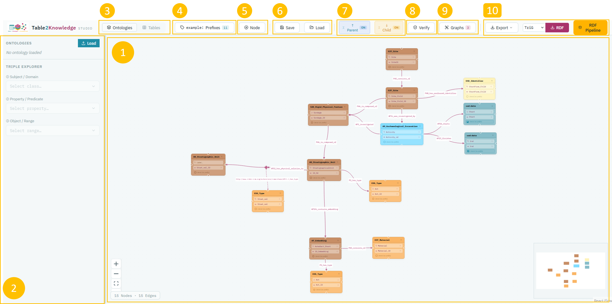
</p>


### 1. Load Ontologies
 
First, you need to load one or more ontologies. Make sure the Ontology Panel is showing in your side panel ① and click **"Load"** ②.

<p>
    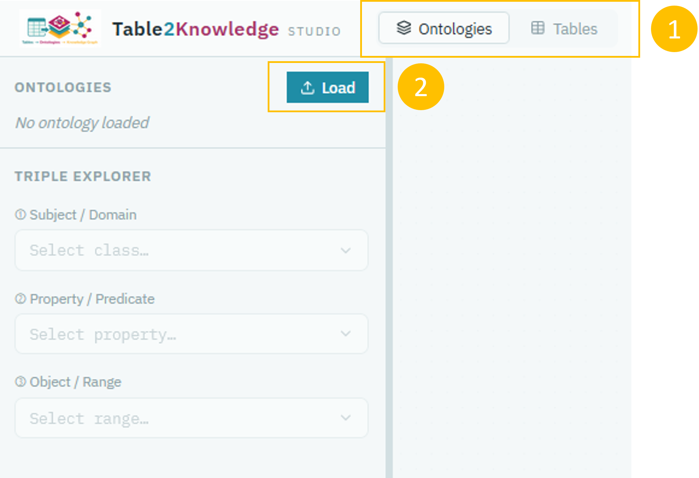
</p>

Supported types are: `.ttl`, `.rdf`, `.owl`, `.xml`, `.nt` and `.n3`

You can add more ontologies at any time or remove them by clicking ❌.

<p>
    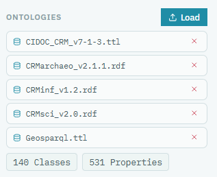
</p>

### 2. Explore the Ontologies: Search for Entities, Properties and Connections

You can search through all loaded ontologies for specific entities: under **"Subject/Domain"** in the Ontology Panel, click **"Select Class"** ① and search for the desired term ②. To read the description of an entity, click the ℹ button ③. To select an entity as subject/domain, simply click on it. The selected class will appear in the Subject/Domain field ④.

<p>
    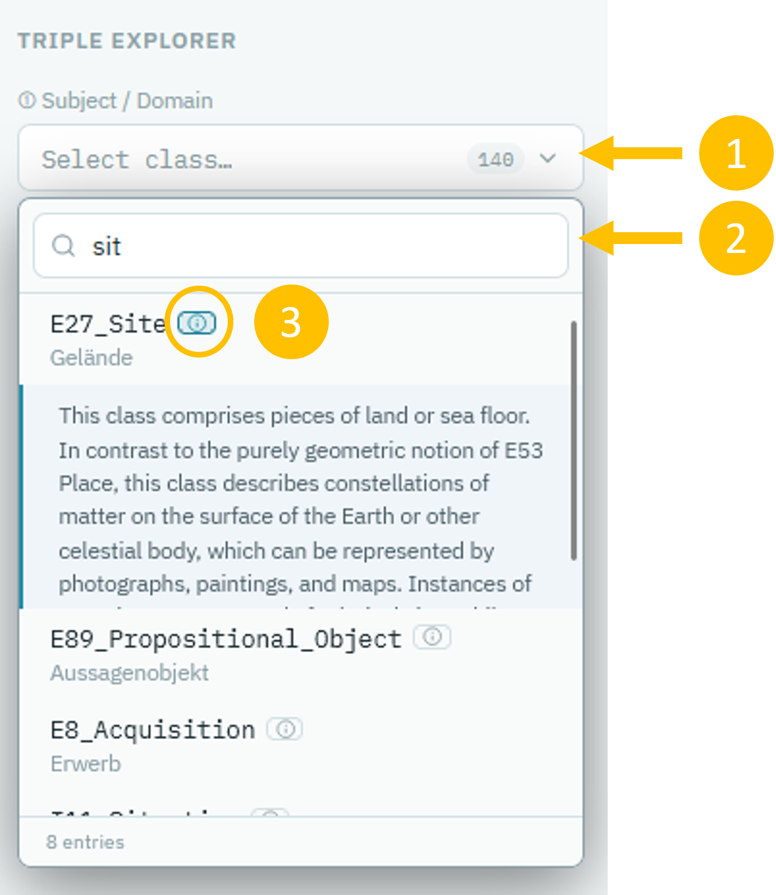
    &nbsp;&nbsp;&nbsp;&nbsp;&nbsp;&nbsp;&nbsp;&nbsp;&nbsp;&nbsp;&nbsp;&nbsp;&nbsp;&nbsp;&nbsp;&nbsp;
    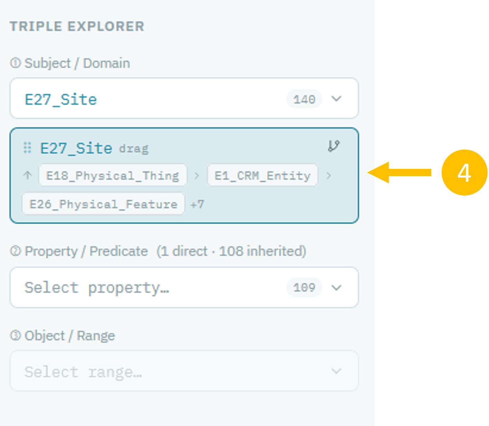
</p>

Depending on your [widening settings](#widening-settings), all valid properties for the selected entity are shown in the **Property/Predicate** dialog. You can search and select your desired property. 

After you have selected the property, all valid entities for the object/range are displayed. You can search and add them in the same way.
<p>
    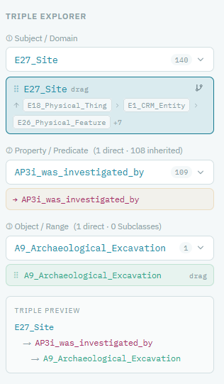
</p>

> **Note:** Throughout this guide, we use *Subject* and *Domain* as well as *Object* and *Range* synonymously, as the Triple Explorer reflects both RDF triple terminology and OWL property definitions.

### 3. Build Your Conceptual Graph
Now you can start building your conceptual graph. Drag and drop subjects and objects onto the canvas. They will automatically be colored according to the CIDOC CRM color convention (see [this discussion](https://cidoc-crm.org/Issue/ID-457-harmonization-of-graphical-documentation-about-crm) and [this document](https://cidoc-crm.org/sites/default/files/CIDOC%20CRM%20Diagram%20Guidelines.docx)).

<p>
    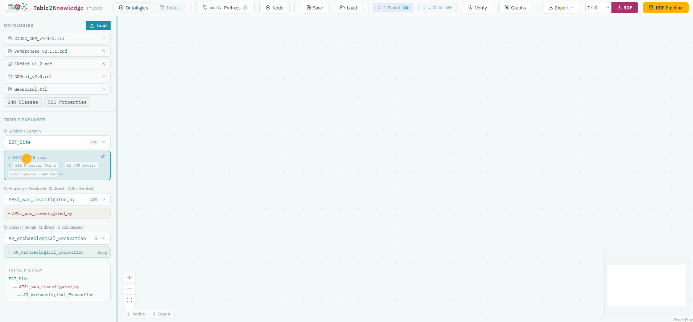
</p>

If a node is selected on the canvas when you drop a new one, the property between subject and object will automatically be created.
 
<p>
    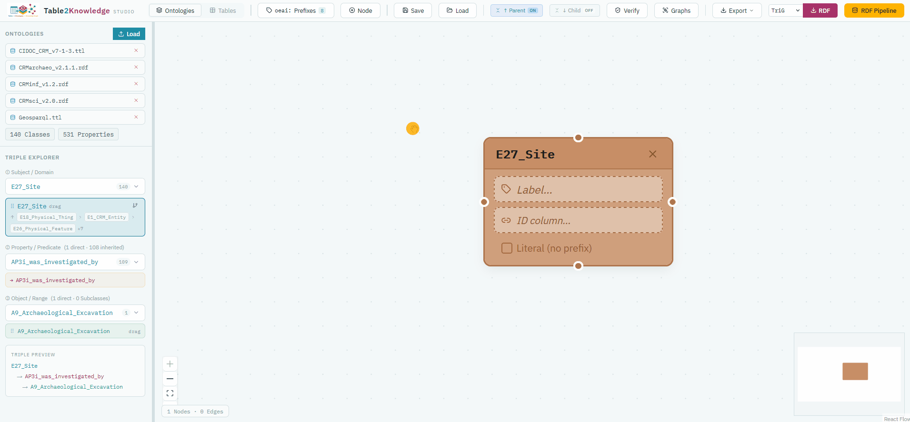
</p>
 
If no node is selected, no connection will be created. You can link nodes at any time by dragging a connection between them. All valid properties (based on your [widening settings](#widening-settings)) will be displayed.
 
<p>
    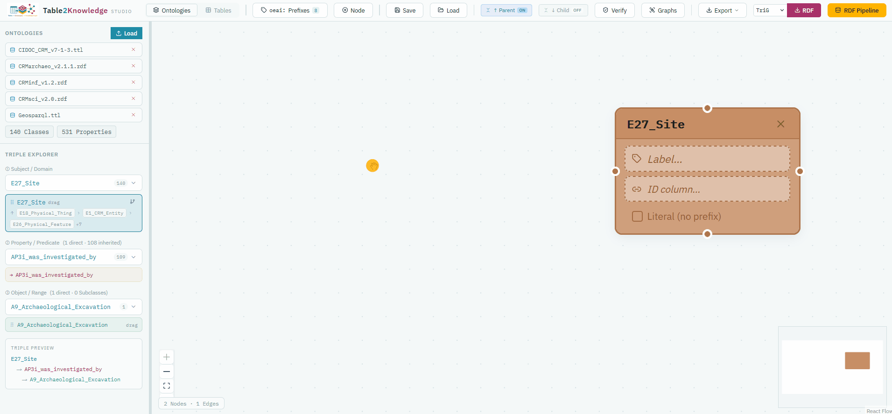
</p>
 
If you need to change the exit or entry point of a property, you can edit the source and target handles at any time:
 
<p>
    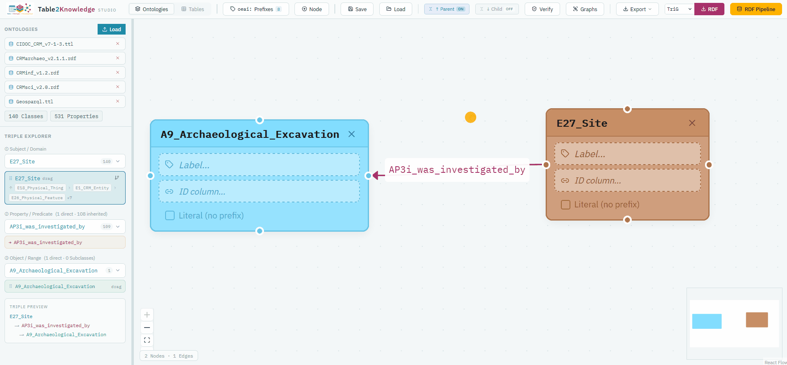
</p>
 
You can also add custom nodes at any time:
 
<p>
    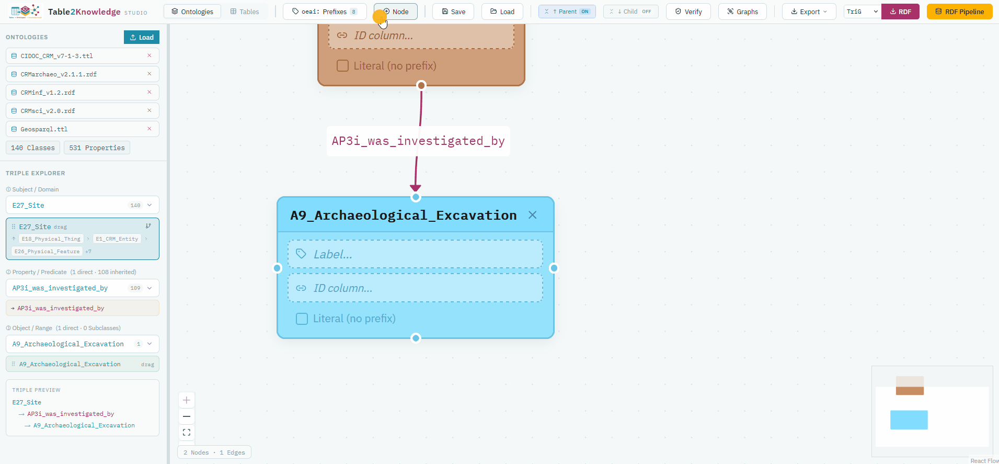
</p>
 
#### Widening Settings
 
You can configure different widening settings depending on how strictly you want to align your data with the loaded ontologies.
 
If both widening options are deactivated, only connections that are directly specified in the loaded ontologies will be suggested.
 
If you activate **Widening Parent**, all entities will also inherit the properties of their parent classes. For example: connecting `E27_Site` with `P46_is_composed_of` to `S20_Rigid_Physical_Feature` is not directly specified in CIDOC CRM. However, `E27_Site` can inherit `P46_is_composed_of` from a parent entity. With the Widening Parent function deactivated, this connection will not appear in the Triple Explorer; with it activated, the connection is shown:
 
<p>
    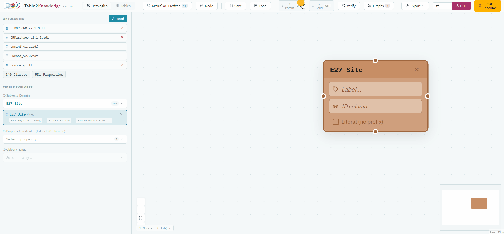
</p>
 
The same principle applies to **Widening Child**: connecting `A8_Stratigraphic_Unit` with `AP19i_contains_embedding` to `A7_Embedding` is, by definition, not a valid connection in CRMarchaeo, since `AP19i_contains_embedding` is a property of `A2_Stratigraphic_Volume_Unit`, not `A8_Stratigraphic_Unit`. But `A2_Stratigraphic_Volume_Unit` is a child class of `A8_Stratigraphic_Unit`, so with Widening Child activated, the connection appears in the Triple Explorer:
 
<p>
    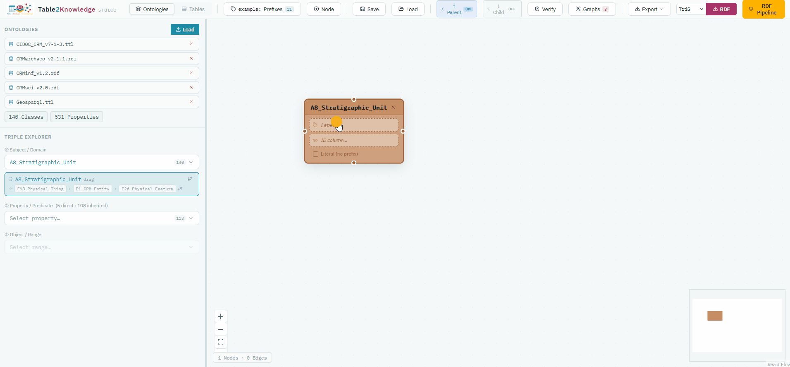
</p>
 
#### Dot-One Properties (RDF-star)
 
Table2Knowledge supports annotating relationships — for example, typing a stratigraphic relation:
 
> *"SU1002 has a physical relation to SU1001, and that relation has type 'below'"*
 
To create a dot-one property, select an edge in the graph and then drag an ontology class onto it. A visual midpoint appears on the edge representing the annotation.
 
You can add a property based on the loaded ontologies. However, since dot-one properties in CIDOC CRM follow a specific numbering convention (e.g. `AP11.1_has_type` for the property `AP11_has_physical_relation_to`), in the current version you need to enter the full URI manually:
 
<p>
    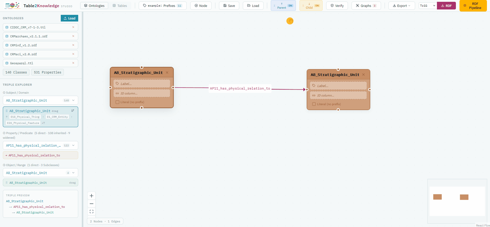
</p>
 
### 4. Named Graphs
 
You can group nodes into named graphs (useful for CIDOC CRM's I4_Proposition_Set or any named graph context):
 
1. Select nodes in the graph (Shift+Click or drag a selection box)
2. Open the **Graphs** panel
3. Enter a label and click **Selection → Graph**
 
Click on a named graph entry to highlight its nodes with a colored bounding box and zoom to fit.
 
<p>
    
</p>
 
> **Note:** Named graphs are only exported in **TriG** and **N-Quads** formats.
 
### 5. Map Your Data onto the Conceptual Graph
 
To enrich your conceptual graph with your own data, switch to the **Table Panel** and load your tables (`.csv`, `.tsv`, `.xls`, `.xlsx`). Your tables will be loaded and the first 10 rows will be shown.
 
<p>
    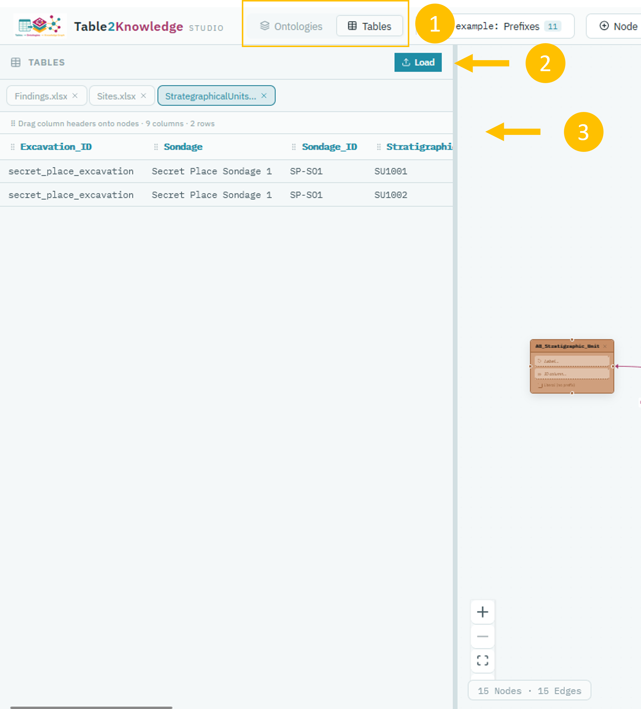
</p>
 
Simply drag and drop the columns onto the respective node. For each node, your table must include a unique ID column and optionally a label column. The general prefix does not need to be included in the cell values — you can specify one general prefix in the [Prefix Manager](#6-prefix-manager).
 
If a value needs a prefix different from the ontology prefixes or the general prefix, indicate it directly in the cell using the format `prefix:value` (e.g. `geonames:2782113`).
 
<p>
    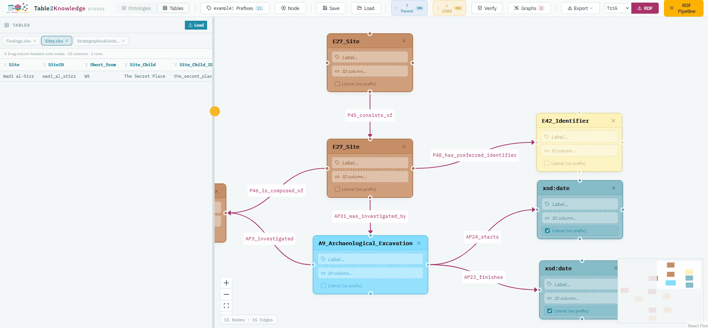
</p>
 
If a node contains literal values — meaning that no prefix should be added automatically — you can activate the **Literal (no prefix)** option on the respective node. If the checkbox is unchecked ①, the global prefix will be added to these values. If the box is checked ②, no prefix will be added:
 
<p>
    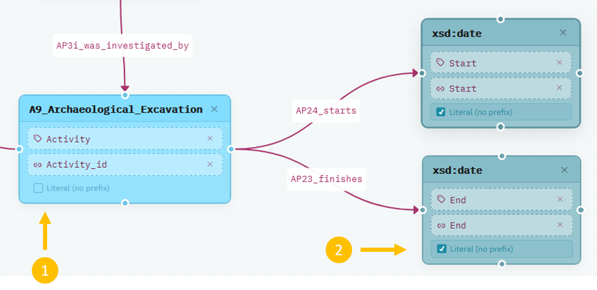
</p>
 
### 6. Prefix Manager
 
All namespace prefixes must be defined for correct RDF URI expansion. It is best to open the Prefix Manager right before exporting, as by then all prefixes in your data should be present. The **Prefix Manager** checks your data and manages all prefixes:
 
- Auto-detects prefixes from loaded ontologies
- Scans table data for prefixed values and warns about undefined prefixes
- Manages the **Data ID Prefix**, which is automatically added to all data values that have no specified prefix and no activated **Literal (no prefix)** option (e.g. `example:`)
 
You can resolve automatically detected but undefined prefixes by clicking on them and adding the URI. You can also define your **Data ID Prefix** or any other prefixes manually:
 
<p>
    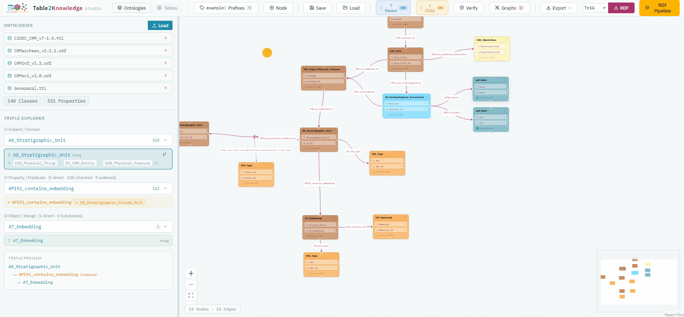
</p>
 
### 7. Validate Your Graph
 
You can validate your graph at any time. The check covers both the conceptual graph (warning you about invalid connections) and your mapped columns (for example, missing join keys or IDs that contain spaces).
 
<p>
    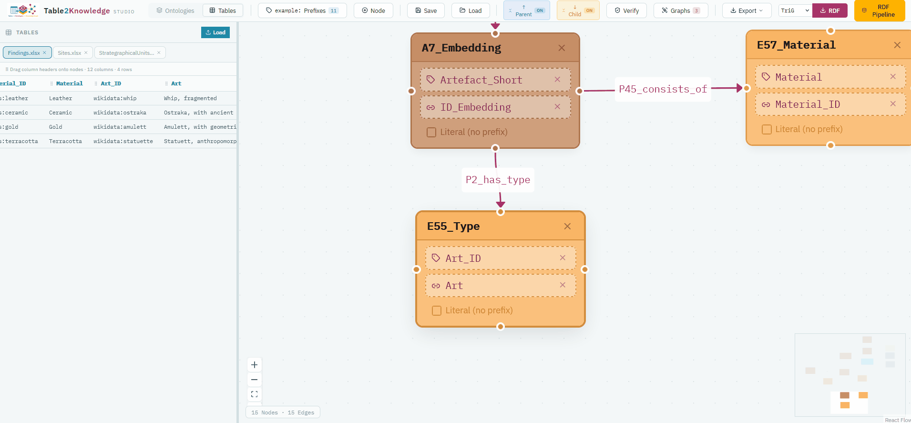
</p>
 
### 8. Export
 
You can export your graph as `.graphml`, `.png` or `.svg`.
 
You can also export your data directly as RDF. Supported formats are: `TriG`, `N-Quads`, `Turtle`, `RDF/XML`, `N-Triples` and `JSON-LD`.
 
> **Note:** Named graphs are only supported in `TriG` and `N-Quads`.
 
| Format | Description |
|---|---|
| **RDF** (TriG, Turtle, etc.) | Direct 1-click RDF export with RDF-star support |
| **RDF Pipeline** | 3-step workflow via Ontotext Refine → GraphDB |
| **GraphML** | yEd-compatible graph with colors and positions |
| **PNG** | Image at 2× resolution |
| **SVG** | Scalable vector graphic, editable in Illustrator / Inkscape |
 
#### RDF Pipeline
 
You can also start the **RDF Pipeline**:
 
**① Export** your data as `.tsv` with fully resolved URIs.
 
<p>
    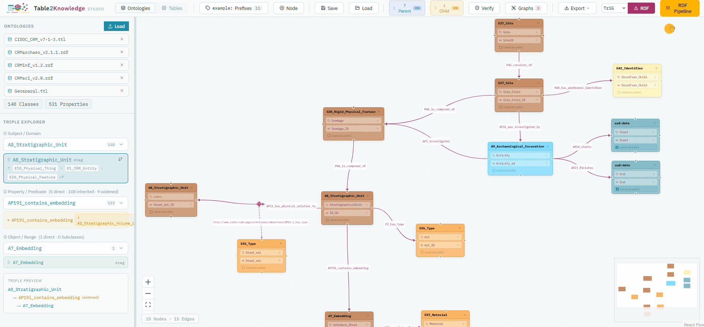
</p>
 
**② Ontotext Refine:** The exported data from step ① is pre-filled automatically, but you can also load a different or modified `.tsv` file. You need to specify the path to the `ontorefine-cli` JAR (included in the project) and your desired Ontotext Refine project name.
 
> **⚠ This step requires Ontotext Refine to be running on your computer.**
 
<p>
    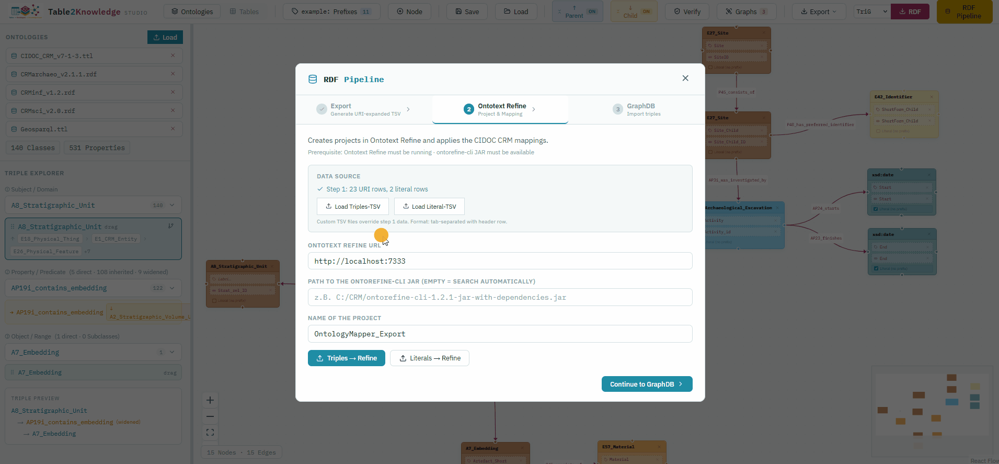
</p>
 
**③ GraphDB:** In the third step, the data will be loaded into GraphDB. The Ontotext Refine project IDs are set automatically from step ②, but you can also define them manually. You can load all existing repositories from GraphDB and select one, or enter the name of a new repository to create it.
 
> **⚠ This step requires GraphDB to be running on your computer.**
 
<p>
    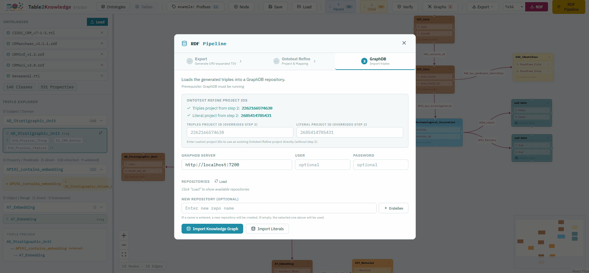
</p>
 
---
 
## Saving & Loading Projects
 
You can save and load your Table2Knowledge Studio projects at any time. They are saved as JSON files containing:
 
- All nodes with positions, colors, mapped columns, and table data
- All edges with properties, join keys, and dot-one annotations
- Named graph definitions
- Prefix map and configuration
 
This means you can save your work, close the application, and resume later — even without the original table files loaded.
 
---
 
## Example Data
 
To help you get started, example data is included in the `0_exampleData/` folder:
 
| File | Description |
|---|---|
| `Sites.xlsx` | Example table: archaeological sites |
| `StratigraphicalUnits.xlsx` | Example table: stratigraphic units |
| `Findings.xlsx` | Example table: findings |
| `prefixes.txt` | Example prefix definitions |
| `modelling/` | Full example project (`.json`), a direct RDF export, and the two TSVs from the RDF Creation Pipeline |
 
Load the `.xlsx` files via the Table Panel, open the project `.json` via **Load** in the toolbar, and you have a complete working example to explore.
 
---
 
## CIDOC CRM Support
 
While Table2Knowledge works with any RDF/OWL ontology, it has built-in support for CIDOC CRM:
 
- **Color coding** — Nodes are colored by their CRM anchor class (e.g. brown for Physical Things, blue for Temporal Entities, pink for Actors)
- **Label preference** — German `rdfs:label` translations are preferred, with fallback to English
- **CRM extensions** — Supports CRMarchaeo, CRMsci, LRMoo and other CIDOC extensions
- **Auto-prefixing** — CRM property patterns (`P1_`, `AP3_`, `SP5_` etc.) are auto-resolved to `crm:` prefix
 
---
 
## Troubleshooting
 
**Port 8000 or 3000 already in use**
Another application is occupying the port. Close that application, or change the port: for the backend, edit the `--port` argument in `start.bat`/`start.sh`; for the frontend, edit `vite.config.js`.
 
**"python is not recognized" (Windows)**
During Python installation, the option **"Add Python to PATH"** was not checked. Either reinstall Python with that option enabled, or add Python to your PATH manually.
 
**"npm is not recognized" / Node.js commands fail**
Node.js is not installed or not in your PATH. Install Node.js 18+ from <https://nodejs.org/en/download/> and restart your terminal.
 
**Frontend shows a blank page**
Check that the backend is running on port 8000. Open <http://localhost:8000/health> in your browser — you should see `{"status": "ok"}`. If not, restart the backend.
 
**Ontologies are not loading / classes not showing up**
Check that the uploaded file is a supported format (`.ttl`, `.rdf`, `.owl`, `.xml`, `.nt`, `.n3`) and contains valid RDF. Malformed ontology files will silently fail to parse — try opening the file in a text editor or an RDF validator first.
 
**Properties are missing in the Triple Explorer**
Enable **Widening Parent** and/or **Widening Child** in the toolbar. Without widening, only properties with a direct `rdfs:domain` match are shown.
 
**Undefined prefixes after export**
Open the **Prefix Manager** before exporting. Any prefix detected in your table data that is not defined will be listed with a ⚠ warning. Click on it and add the full URI.
 
**Ontotext Refine: "JAR not found"**
Specify the full path to `ontorefine-cli.jar` in Step 2 of the RDF Pipeline. The JAR is included in the project folder.
 
**RDF Pipeline fails at Step 2 or Step 3**
Make sure Ontotext Refine (Step 2) and/or GraphDB (Step 3) are actually running on your computer and reachable at the configured URLs.
 
---
 
## License
 
GPL 3.0
 
---
 
## Acknowledgments and Credits
 
**RDF Pipeline** incl. all scripts for Ontotext Refine and GraphDB:
*Gerald Hiebel, University of Innsbruck, Institute of Archaeology and Digital Science Centre*
<Gerald.Hiebel@uibk.ac.at> · [University page](https://www.uibk.ac.at/archaeologien/institut/mitarbeiter/gerald-hiebel/gerald_hiebel.html) · [ORCID: 0000-0002-3799-8391](https://orcid.org/0000-0002-3799-8391)
 
**Ontotext Refine Client:** <https://github.com/Ontotext-AD/ontorefine-client> — *Apache-2.0 license*
 
Developed for digital archaeology and cultural heritage data management. The CIDOC CRM color scheme follows established conventions in the CRM community.